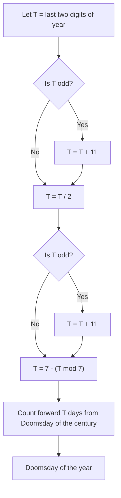

import "./style.css";
import DynamicDoomsdayDisplay from "./DynamicDoomsdayDisplay.astro";
import DynamicDoomsdayYearSelector from "./DynamicDoomsdayYearSelector.astro";

Generally, the idea is that there are certain dates in a year, that always fall on the same day of the week. 
We call those dates Doomsdays and there are rules for finding the Doomsday of every month. 
From these Doomdays, we can determine the weekday of any given date using only addition & subtraction, using multiples of 7. 
For this trick you should be able to do this comfortable in your head. We get started with the easiest months:

## (Most) Even Months

We can use (almost) any even month for determining the Doomsday of a given year. For any even-numbered month except February, 
the same day is the Doomsday as the months number. This means:

- the 4th of April (4) is a Doomsday,
- the 6th of June (6) is a Doomsday,
- the 8th of August (8) is a Doomsday,
- the 10th of October (10) is a Doomsday,
- the 12th of December (12) is a Doomsday.

Generally, for the Nth _even_ month, the Nth day is a Doomsday.

We can use this for our first weekday calculation. Let's ask ourselves, what weekday is Halloween (31st of October) <DynamicDoomsdayDisplay display="year" suffix="?">2026</DynamicDoomsdayDisplay>
We know that the 10th of October is a <DynamicDoomsdayDisplay display="weekday">Saturday</DynamicDoomsdayDisplay> because it is a Doomsday. 
Calculating 31 - 10 = 21, we know that it is exactly three weeks afterward a Doomsday.
Therefore, **Halloween is a Doomsday**. In <DynamicDoomsdayDisplay display="year" suffix=",">2026</DynamicDoomsdayDisplay> Halloween falls on a <DynamicDoomsdayDisplay display="weekday" suffix=".">Saturday</DynamicDoomsdayDisplay>

To make finding the weekday easier, we can represent the weekdays as numbers ranging from 0 (Sunday) to 6 (Saturday). 
The number of the weekday of any given date can be computed by adding the number of the Doomsday weekday and the offset to the nearest Doomsday 
and then computing modulo 7 of that value.

Let's try again with the [German Unity Day](https://en.wikipedia.org/wiki/German_Unity_Day) (3rd of October) <DynamicDoomsdayDisplay display="year" suffix=".">2026</DynamicDoomsdayDisplay> We use the Doomsday of October, which is the 10th.
Calculating 3 - 10 = -7, we know that it is exactly one week before a Doomsday. Therefore, the German Unity Day is exactly one week before a Doomsday. **German Unity Day always falls on the same weekday as the Doomsday**.

Let's take a look at the last remaining even month:

## February

The Doomsday is always the last day of february, e.g. **February 28 or 29**.
In <DynamicDoomsdayDisplay display="year" suffix=",">2026</DynamicDoomsdayDisplay> February <DynamicDoomsdayDisplay display="february-day" /> is a <DynamicDoomsdayDisplay display="weekday" valueClass="font-bold" suffix=".">Saturday</DynamicDoomsdayDisplay>

Again, we want to compute the weekday of a given date, let's say Groundhog Day (2nd of February) <DynamicDoomsdayDisplay display="year" suffix=".">2026</DynamicDoomsdayDisplay> 
We know that the Doomsday is the <DynamicDoomsdayDisplay display="february-day" suffix="th">28</DynamicDoomsdayDisplay> of February, so we compute 
2 - <DynamicDoomsdayDisplay display="february-day">28</DynamicDoomsdayDisplay> = <DynamicDoomsdayDisplay display="february-day" offset={-2} prefix="-">26</DynamicDoomsdayDisplay> as we are going 
backwards three weeks (21 days) and then <DynamicDoomsdayDisplay display="february-day" offset={-2} resultModulo={7}>5</DynamicDoomsdayDisplay> more.
<DynamicDoomsdayDisplay display="february-day" offset={-2} prefix="-">26</DynamicDoomsdayDisplay> modulo 7 is <DynamicDoomsdayDisplay display="february-day" offset={2} resultModulo={7} suffix=".">2</DynamicDoomsdayDisplay> 
Going forward <DynamicDoomsdayDisplay display="february-day" offset={2} resultModulo={7} /> days is the same as going backwards <DynamicDoomsdayDisplay display="february-day" offset={-2} resultModulo={7} /> days
because of the cyclic nature of the week. Adding this to the Doomsday <DynamicDoomsdayDisplay display="weekday">Saturday</DynamicDoomsdayDisplay> 
<DynamicDoomsdayDisplay display="weekday-number" prefix="(" suffix=")">6</DynamicDoomsdayDisplay> modulo 7, we get <DynamicDoomsdayDisplay display="weekday-number-of" value="02.02." suffix=",">1</DynamicDoomsdayDisplay> 
e.g. <DynamicDoomsdayDisplay display="weekday-of" value="02.02." suffix=".">Monday</DynamicDoomsdayDisplay>

## Some Odd Months

Odd months do not have such a simple rule for their Doomsday as even months. May, July, September, and November each have a "partner-month" where the Doomsday is the number of the partner-month. 
For this, a simple mnemonic exists:

> I work 9-5 at 7-11.

From this, we can easily deduce what the partner-months may be and remember the following Doomsdays:

- the 9th of May (5) is a Doomsday,
- the 11th of July (7) is a Doomsday,
- the 5th of September (9) is a Doomsday,
- the 7th of November (11) is a Doomsday.

For example, to compute the weekday of the [International Day of Peace](https://en.wikipedia.org/wiki/International_Day_of_Peace) (21st of September) <DynamicDoomsdayDisplay display="year" suffix=",">2026</DynamicDoomsdayDisplay> we can use the Doomsday of September, which is the 5th.
Calculating 21 - 5 = 16, we know that it is exactly two weeks and two days after a Doomsday. Therefore, **the International Day of Peace is two days after a Doomsday**. 
In <DynamicDoomsdayDisplay display="year" suffix=",">2026</DynamicDoomsdayDisplay> the International Day of Peace falls on a <DynamicDoomsdayDisplay display="weekday-of" value="21.09." suffix=".">Monday</DynamicDoomsdayDisplay>

## March & January

There are two memorable dates in March that can be used as Doomsdays: either the 0th of March (which is the same as the last day of February) or the 14th of March ([Pi Day](https://en.wikipedia.org/wiki/Pi_Day)).

January is a bit more difficult, as it lays before the leap day in February. The Doomsday of January is the 3rd in common years and the 4th in leap years. Another way would be to think of January belonging to the previous year, where the Doomsday of the previous year is on the 2nd of January.

What was New Year's Day (1st of January) <DynamicDoomsdayDisplay display="year" suffix="?">2026</DynamicDoomsdayDisplay> We can use the nearest Doomsday: January <DynamicDoomsdayDisplay display="if-leap-year" value="4th" valueAlt="3rd" suffix=".">3rd</DynamicDoomsdayDisplay>
<DynamicDoomsdayDisplay display="january-day" offset={-1}>2</DynamicDoomsdayDisplay> days before the Doomsday <DynamicDoomsdayDisplay display="weekday" prefix="(" suffix=")">Saturday</DynamicDoomsdayDisplay> is a <DynamicDoomsdayDisplay display="weekday-of" value="01.01." suffix=".">Thursday</DynamicDoomsdayDisplay>

Now, we know how to compute the weekday of any given date, but we still need to find the Doomsday of a given year.

## Computing the Doomsday of a Year

Let's take a look at how to compute the Doomsday of a given year from the Doomsday of the century. I am going to present two methods -- the first one is more intuitive and easier to remember, while the second one is more mathematically pure.

First, we take the last two digits of the year. If this number is odd, we add 11 to it. Then, we divide the number by 2. If the result is odd, we add 11 again. 
Finally, we take 7 minus modulo 7 of the result and count forward that many days from the Doomsday of the century. The resulting weekday is the Doomsday of the year.
This algorithm can be remembered with the following flowchart:

The second method is more mathematical and follows the steps:

1. Take the last two digits of the year and divide by 12. Let A be the quotient and B be the remainder.
2. Divide B by 4 and let C be the quotient.
3. Take the sum of the Doomsday of the century, A, B, and C. The result modulo 7 is the Doomsday of the year.

For example, let's compute the Doomsday of the year 1999. The Doomsday of the 1900s is a Wednesday (3). 
The last two digits of the year are 99. Dividing 99 by 12 gives a quotient of 8 and a remainder of 3. 
Dividing the remainder (3) by 4 gives a quotient of 0. Adding these values together gives us 3 + 8 + 3 + 0 = 14. 
Taking this result modulo 7 gives us 0, which corresponds to Sunday. Therefore, the Doomsday of the year 1999 is a Sunday.

To showcase the first method, let's compute the Doomsday of the year 1975. Remember, the Doomsday of the 1900 is a Wednesday (3). 
The last two digits of the year are 75, which is odd, so we add 11 to get 86. Then we divide 86 by 2 to get 43, which is odd, so we add 11 again to get 54. 
Finally, we take 7 minus 54 modulo 7, which is 7 minus 5 and gives us 2. Counting forward 2 days from Wednesday (3) gives us Friday (5).

### Increasing Speed by Memorization

By memorizing the years in a century that have the same Doomsday as the century's Doomsday, we can increase our speed significantly.
The following years of every century share the same Doomsday:

- 00
- 06
- 11.5
- 17
- 23
- 28
- 34
- 39.5
- 45
- 51
- 56
- 62
- 67.5
- 73
- 79
- 84
- 90
- 95.5

You might have wondered why some of the years have a .5. Due to leap years, the year with the same Doomsday is skipped in that position. 
Still, it is useful to remember these years, as X.5 means that year X has remembered Doomsday - 1 and year X + 1 has remembered Doomsday + 1.
For example, we know that the Doomsday of the 1900s is a Wednesday (3) and that 11.5 has the same Doomsday. Therefore, the Doomsday of 1911 is a Tuesday (2). 
The next year, 1912, is a leap year, so the Doomsday of 1912 is a Thursday (4) again.

## Doomsday of the Century

Starting from the year 1600, the Doomsday of the century follows a simple pattern:

- 1600: Tuesday (2)
- 1700: Sunday (0)
- 1800: Friday (5)
- 1900: Wednesday (3)
- 2000: Tuesday (2)
- 2100: Sunday (0)
- 2200: Friday (5)
- 2300: Wednesday (3)
- ...

The reverse order can be remembered with the mnemonic "Son to wed Friday" (Sun, Tue, Wed, Fri), e.g. the son is getting married on Friday.

## Closing Words

The Doomsday Algorithm was invented by [John Horton Conway](https://en.wikipedia.org/wiki/John_Horton_Conway) in 1973.
Maybe you know him from the [Game of Life](https://en.wikipedia.org/wiki/Conway%27s_Game_of_Life) three years earlier.

Due to the change from the Julian calendar to the Gregorian calendar, the presented method for computing the Doomsday of the century only works for years 1600 and after.

To make this article more interactive, I have written it in a way that works not only for the current year, but for any year.
Feel free to play around with the year selector and read this article again for your birth year or any other year you are interested in.

Article version for the year <DynamicDoomsdayYearSelector suffix="." />

## Sources

- https://en.wikipedia.org/wiki/Doomsday_rule
- https://www.rudy.ca/doomsday.html
- [Conway's original paper: "Tomorrow is the day after Doomsday"](https://web.archive.org/web/20240907031643/https://www.archim.org.uk/eureka/archive/Eureka-36.pdf)
