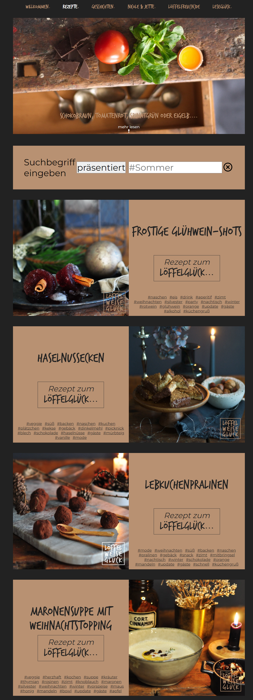

This project was the first website I created, that had a sort of database behind it, the recipes and stories. I started not long after my [first project](../studio-nicolehoelting/) and made the same mistakes. I copied a prepared HTML file for each recipe which loaded `.txt` files for the ingredients and preparation. For the recipe list I used a JSON file that was requested, parsed and rendered as elements on the page.

Again, I tried to solve the problem with Next.js, but I never finished it and switched to Astro which allows defining the recipes as a scheme and easy adding of them as a Markdown file.

