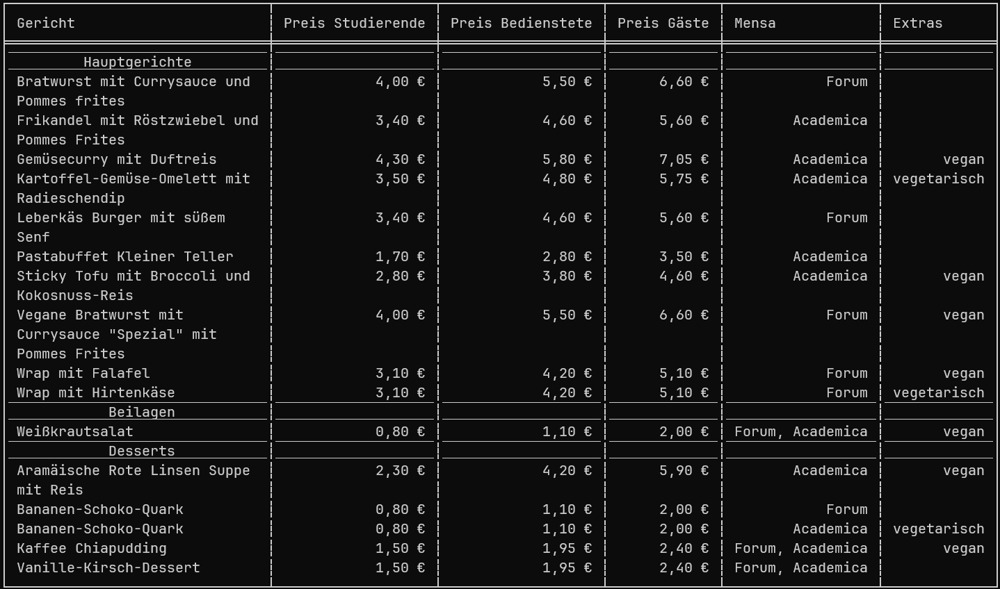

A small tool I wrote in Rust for checking which meals I can eat at university.



Allows choosing the day, the locations and which prices to show.

It works by parsing the command-line arguments with [clap](https://crates.io/crates/clap) and [asynchronously](https://crates.io/crates/tokio) [requesting](https://crates.io/crates/reqwest) and [scraping](https://crates.io/crates/scraper) the webpage. The gathered data is filtered and displayed as a [table](https://crates.io/crates/comfy-table).

## Usage

-   Show the menu for today

    ```bash
    mensa-upb-cli
    ```

-   Show the help screen

    ```bash
    mensa-upb-cli --help
    ```

-   Show the menu of the third next day

    ```bash
    mensa-upb-cli -d 3
    ```

-   Show the menu of a different mensa

    ```bash
    mensa-upb-cli -m grill-cafe
    ```

-   Show the only the prices for students
    ```bash
    mensa-upb-cli -p student
    ```
