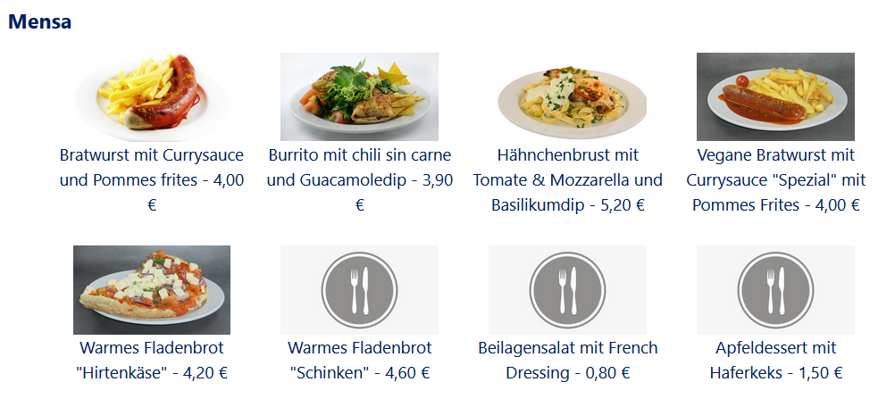

Sitting in Lecture, a fellow student and I found out, that you could add a textblock to your dashboard on our university management website and enter a HTML mode. First we wanted to insert custom styles. Quickly we found out that the style tag was not allowed and turned our interest to javascript. Interestingly, this was not blocked by the page.

My friend quickly started to build a basic version of the chrome dino game and displayed it on his dashboard. I wanted to display the menu of the canteen, so I did not need to switch to a different website.

After starting, I realized that the canteen does not offer a public API to query for me in javascript. So I reused part of the codebase of my earlier project [canteen cli](../mensa-upb-api/). Using this and the crate [actix-web](https://crates.io/crates/actix-web), I build an API, that can be used to get the dishes on the menu and that scrapes the official website in the background. To not harm the canteens website, the server only scrapes the page at most once a day and only if requested and caches the result. A nice side effect of this is that subsequent requests are much faster, not having to perform the web scraping.

The code of the API can be found [on my github](https://github.com/moritz-hoelting/mensa-upb-api) and it should be possible to tweak the scraping to be compatible with other canteens.
